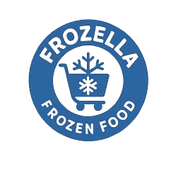
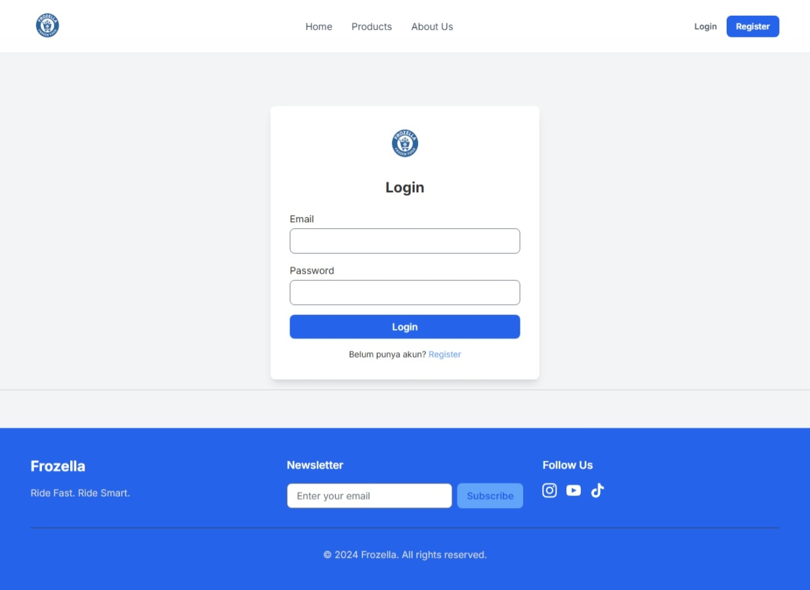

<p align="center">
  
</p>

<h1 align="center">Frozella - Modern Frozen Food Catalog & Ordering System</h1>

<p align="center">
  <b>Frozella</b> is a modern, professional web application for managing and selling frozen food products. Built with Laravel, it features a beautiful blue-themed branding, a user-friendly interface, and a robust admin dashboard for product and order management.
</p>

---

## ✨ Features

- **Modern Frozella Branding**: Cool blue color theme, logo, and professional UI/UX.
- **Product Catalog**: Browse, search, and filter frozen food products by category.
- **Product Images**: Upload and display product images with fallback to default if missing.
- **Order System**: Users can order products, view order history, and manage their profile.
- **Admin Dashboard**: Full CRUD for products and orders, including image upload and category management.
- **Authentication**: User registration, login, and role-based access (admin/user).
- **Responsive Design**: Mobile-friendly and modern layout for all pages.
- **Testimonials & About Page**: Attractive homepage with testimonials and company info.

---

## 🚀 Technology Stack
- **Backend**: Laravel (PHP)
- **Frontend**: Blade, Tailwind CSS
- **Database**: MySQL/MariaDB
- **Image Storage**: Laravel Storage (public disk)
- **Authentication**: Laravel Auth

---

## ⚡️ Quick Start

### 1. Clone & Install Dependencies
```bash
git clone <repo-url>
cd frozella
composer install
npm install && npm run build
```

### 2. Environment Setup
- Copy `.env.example` to `.env` and set your database credentials.
- Generate app key:
```bash
php artisan key:generate
```

### 3. Database Migration & Seeding
```bash
php artisan migrate --seed
```

### 4. Storage Link (for product images)
```bash
php artisan storage:link
```

### 5. Run the App
```bash
php artisan serve
```
Visit [http://localhost:8000](http://localhost:8000)

---

## 🛠️ Admin Access
- Default admin account is created via seeder (see `database/seeders/DatabaseSeeder.php`).
- Admin can manage products, orders, and categories from the dashboard.

---

## 📁 Project Structure (Highlights)
- `app/Http/Controllers/` — Controllers for products, orders, auth, admin, etc.
- `app/Models/` — Eloquent models (Product, Order, User, etc.)
- `resources/views/` — Blade templates for frontend and admin
- `public/images/` — Static images and Frozella logo
- `storage/app/public/products/` — Uploaded product images

---

## 💙 Frozella Branding
Frozella is designed with a fresh, cool blue color palette and a modern, clean layout. All references to previous brands (GO WIZ, CustomBike, sepeda) have been removed for a unified frozen food experience.

---

## 🤝 Contributing
Pull requests are welcome! For major changes, please open an issue first to discuss what you would like to change.

---

## 📄 License
This project is open-sourced under the MIT license.

## 📸 Screenshot Aplikasi

### 1. Tampilan Halaman Login


### 2. Tampilan Halaman Register


### 3. Dashboard / Beranda Setelah Login


### 4. Tampilan Data CRUD Produk (Tabel)


### 5. Form Tambah/Edit Produk
